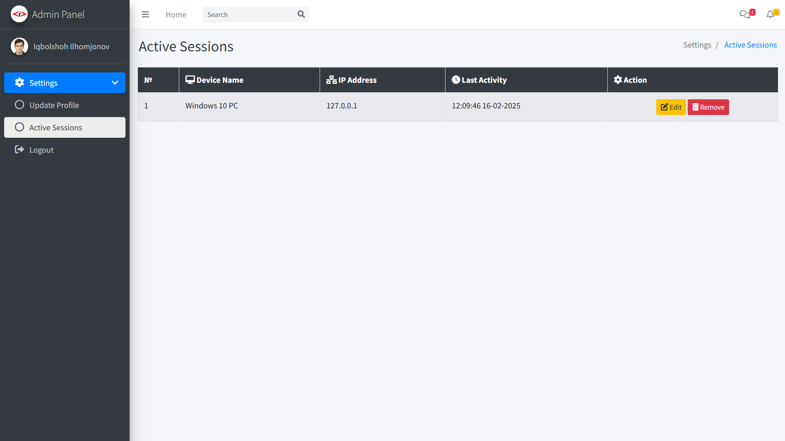
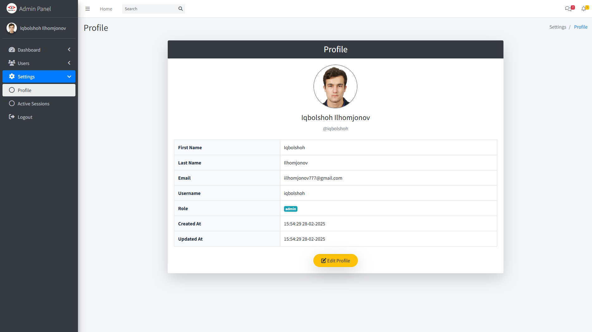
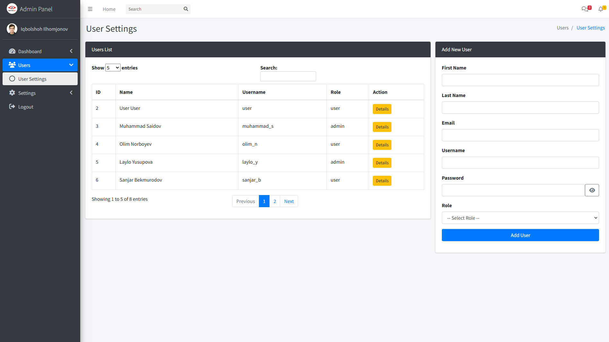
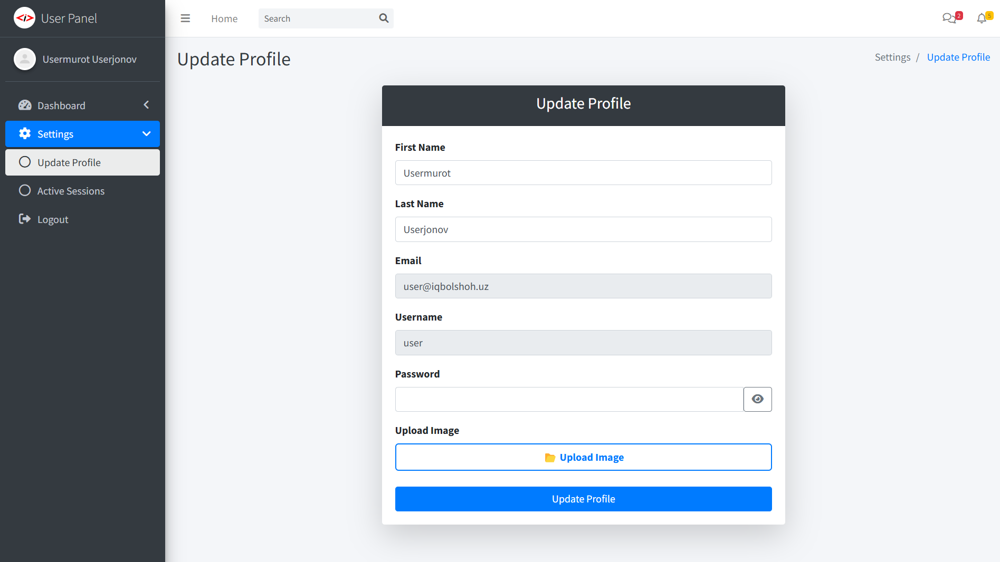

# 🔑 PHP Auth Master  

This repository is a user authentication and role management system built with PHP. It provides an easy-to-use admin panel and allows the creation and management of multiple user roles. Security is the top priority in **PHP Auth Master**, ensuring user data is well-protected.  



## ✨ Features  

- 🔹 **Multiple User Roles** – Easily manage Admin, User, and more.  
- 🔹 **Admin Panel** – Built-in dashboard for role & permission control.  
- 🔹 **Secure Authentication** – Password hashing & session protection.  
- 🔹 **Role-Based Access** – Restrict pages based on user roles.  
- 🔹 **Auto Menu Generation** – Dynamic navigation for admin panel.  
- 🔹 **Advanced Security** – Active session tracking & auto logout on password change.  

## 🛡 Why PHP Auth Master?  

✅ **Secure** – Tracks active sessions & prevents unauthorized access.  
✅ **Easy to Use** – Simple admin panel for quick management.  
✅ **Scalable** – Add new roles & users effortlessly.  
✅ **Real-Time Control** – Monitor & remove active sessions anytime.  

### 🔐 Login Page  

  

- **🖥 Admin Login:** `iqbolshoh`  
- **👤 User Login:** `user`  
- **🔑 Password:** `IQBOLSHOH`  

## 🔍 Preview Pages  

### 🛠 Admin Dashboard  
  
**Admin can view and update their profile.** They can also access system settings and manage various administrative functions.

### 👥 Create User

**Admin can view all users and create multiple new users.** They have full control over user management and permissions.

### 👤 User Dashboard

**Users can view and update their profile.** They can also access available features

---

## 🛠 **Easy Menu Creation**  

Creating a menu in the admin panel is **super easy!** Just define the menu structure, and the system will **automatically** generate the necessary navigation and pages for you. 🎉  

Here’s a simple example:  

```php
$menuItems = [
    [
        "menuTitle" => "Dashboard",
        "icon" => "fas fa-tachometer-alt",
        "pages" => [
            ["title" => "Home", "url" => "index.php"]
        ],
    ],
    [
        "menuTitle" => "Settings",
        "icon" => "fas fa-cog",
        "pages" => [
            ["title" => "Profile", "url" => "profile.php"],
            ["title" => "Active Sessions", "url" => "active_sessions.php"]
        ],
    ]
];
```  

📌 **No need for manual coding**—just define your menu items, and the system takes care of the rest! 🚀

---

## 🚀 Quick Setup  

Get **PHP Auth Master** running in just two steps!  

### 1️⃣ Clone the Repository  
```bash
git clone https://github.com/Iqbolshoh/php-auth-master.git
cd php-auth-master
```

### 2️⃣ Import the Database  
```bash
mysql -u yourusername -p yourpassword < database.sql
```
🔹 Replace `yourusername` & `yourpassword` with your MySQL credentials.  

---

### 🛠 **Easy Database & Role Setup**  

Just edit `config.php` to set up the database:  

```php
define("DB_SERVER", "localhost");
define("DB_USERNAME", "root");
define("DB_PASSWORD", "");
define("DB_NAME", "auth_master");
```

🔑 **Adding Roles?** Just update `ROLES`—the system handles the rest! 🚀  

```php
const ROLES = [
    'admin' => '/admin/',
    'user' => '/', 
    'manager'=>'/manager/' // Add role
];
```

---

## 🖥 Technologies Used
<div style="display: flex; flex-wrap: wrap; gap: 5px;">
    
    
    
     
   
</div>

---

## 🤝 Contributing  

🎯 Contributions are welcome! If you have suggestions or want to enhance the project, feel free to fork the repository and submit a pull request.

## 📬 Connect with Me  

💬 I love meeting new people and discussing tech, business, and creative ideas. Let’s connect! You can reach me on these platforms:

<div align="center">
    <table>
        <tr>
            <td>
                <a href="https://github.com/iqbolshoh">
                    
                </a>
            </td>
            <td>
                <a href="https://t.me/iqbolshoh_777">
                    
                </a>
            </td>
            <td>
                <a href="https://www.linkedin.com/in/iiqbolshoh/">
                    
                </a>
            </td>
            <td>
                <a href="https://instagram.com/iqbolshoh_777" target="blank">
                    
                </a>
            </td>
            <td>
                <a href="https://wa.me/qr/22PVFQSMQQX4F1">
                    
                </a>
            </td>
            <td>
                <a href="https://x.com/iqbolshoh_777">
                    
                </a>
            </td>
            <td>
                <a href="mailto:iilhomjonov777@gmail.com">
                    
                </a>
            </td>
        </tr>
    </table>
</div>
