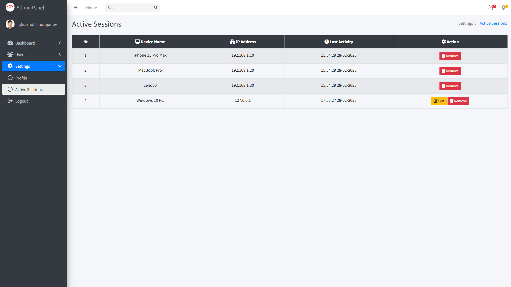
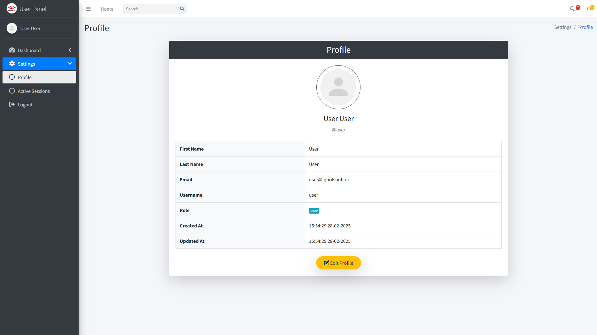

# PHP Auth Master  

This repository is a user authentication and role management system built with PHP. It provides an easy-to-use admin panel and allows the creation and management of multiple user roles. Security is the top priority in **PHP Auth Master**, ensuring user data is well-protected.  



## ✨ Features  

- 🔹 **Multiple User Roles** – Easily manage Admin, User, and more.  
- 🔹 **Admin Panel** – Built-in dashboard for role & permission control.  
- 🔹 **Secure Authentication** – Password hashing & session protection.  
- 🔹 **Role-Based Access** – Restrict pages based on user roles.  
- 🔹 **Auto Menu Generation** – Dynamic navigation for admin panel.  
- 🔹 **Advanced Security** – Active session tracking & auto logout on password change.  

## 🛡 Why PHP Auth Master?  

✅ **Secure** – Tracks active sessions & prevents unauthorized access.  
✅ **Easy to Use** – Simple admin panel for quick management.  
✅ **Scalable** – Add new roles & users effortlessly.  
✅ **Real-Time Control** – Monitor & remove active sessions anytime.  

🚀 **Get started with PHP Auth Master today!**

---

### Login 
 

## 🔐 Security & Active Sessions  

**PHP Auth Master** ensures **strong security** with an **Active Session Management System**, allowing users to track and manage logged-in devices in real time.  

### 🔹 Key Security Features  

- 🖥 **Session Monitoring** – View all active sessions with:  
  - 📌 **Device Name**  
  - 🌍 **IP Address**  
  - ⏳ **Last Activity Time**  
- ❌ **Logout Unwanted Devices** – Remove unauthorized or inactive sessions.  
- 🔄 **Auto Logout on Password Change** – When a password is updated, **all active sessions** are automatically logged out.  
- 🛡 **Real-Time Protection** – Prevents unauthorized access with **session tracking & manual control**.  

### Example: Active Session Table  

When users navigate to **Active Sessions**, they will see something like this:  

| №  | Device Name         | IP Address  | Last Activity        | Action  |
|----|---------------------|------------|----------------------|---------|
| 1  | Windows 11 PC      | 192.168.1.100  | 10:28:42 16-02-2025  | 🔴 Logout |
| 2  | iPhone 15 Pro Max  | 203.45.67.89  | 10:27:34 16-02-2025  | 🔴 Logout |

Users can log out of any session with just one click.  

---

## 🛠 Admin Panel  

To use the admin panel, simply define the menu structure. The system will automatically generate the necessary navigation and pages:  

```php
$menuItems = [
    [
        "menuTitle" => "Settings",
        "icon" => "fas fa-cog",
        "pages" => [
            ["title" => "Update Profile", "url" => "index.php"],
            ["title" => "Active Sessions", "url" => "active_sessions.php"]
        ],
    ]
];
```

---

## Preview Pages  

### Admin Dashboard  
  

### User Dashboard  
  

---

## 🚀 Quick Setup  

Get **PHP Auth Master** running in just two steps!  

### 1️⃣ Clone the Repository  
```bash
git clone https://github.com/Iqbolshoh/php-auth-master.git
cd php-auth-master
```

### 2️⃣ Import the Database  
```bash
mysql -u yourusername -p yourpassword < database.sql
```
🔹 Replace `yourusername` & `yourpassword` with your MySQL credentials.  

---

## 🔧 Database & Role Configuration  

Edit `config.php` to set up the database:  

```php
define("DB_SERVER", "localhost");
define("DB_USERNAME", "root");
define("DB_PASSWORD", "");
define("DB_NAME", "auth_master");

const ROLES = [
    'admin' => '/admin/',
    'user' => '/'
];
```

### 🔹 Key Settings  
✅ **DB Connection** – Default `localhost`, user `root`.  
✅ **Role Management** – Admin & User with auto redirection.  

🚀 **You're ready to go!** Start the project & manage users easily.

---

## Technologies Used

<div style="display: flex; flex-wrap: wrap; gap: 5px;">
    
    
    
     
   
</div>


## Contributing

Contributions are welcome! If you have suggestions or want to enhance the project, feel free to fork the repository and submit a pull request.


## Connect with Me

I love connecting with new people and exploring new opportunities. Feel free to reach out to me through any of the platforms below:

<table>
    <tr>
        <td>
            <a href="https://github.com/iqbolshoh">
                
            </a>
        </td>
        <td>
            <a href="https://t.me/iqbolshoh_777">
                
            </a>
        </td>
        <td>
            <a href="https://www.linkedin.com/in/iiqbolshoh/">
                
            </a>
        </td>
        <td>
            <a href="https://instagram.com/iqbolshoh_777" target="blank"></a>
        </td>
        <td>
            <a href="https://wa.me/qr/22PVFQSMQQX4F1">
                
            </a>
        </td>
        <td>
            <a href="https://x.com/iqbolshoh_777">
                
            </a>
        </td>
        <td>
            <a href="mailto:iilhomjonov777@gmail.com">
                
            </a>
        </td>
    </tr>
</table>
